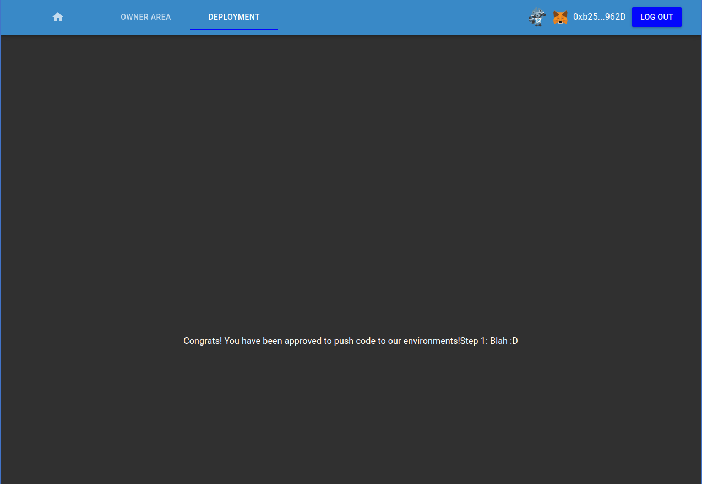

**Title: Blockchain Developer Final Project**
**Author: Anthony Butt (Cheeks)**

# Dependencies
- A [MetaMask Wallet](https://metamask.io/download.html)
- [Node](https://nodejs.org/en/download/)
  - npm comes with node
- [yarn](https://classic.yarnpkg.com/lang/en/docs/install/#debian-stable)
  - `npm install -g yarn`
- [truffle](https://www.trufflesuite.com/docs/truffle/getting-started/installation)
  - `npm install -g truffle`
## My Ethereum Public Address
I would like my NFT Certificat sent here: *0x1a153dcba4dcE094dc0Bc5b502701c457E968070*

## Project Description
**Name**: Code approval NFT certificate
**Summary**: A developer may submit their [***GitLab***](https://gitlab.com) project id for approval by the owner of the smart contract

**Assumptions**:
 - Gitlab is serving as a off chain Oracle
 - The Gitlab project has a configured pipeline
   - The dApp does not gracefully fail if a ci/cd pipeline does not exist 

**Workflow**:
1. A Developer submits their code via their Gitlab project id.
1. dApp fetches data about the latest pipeline run and submits it to the smart contract
1. The owner of the contract may review submissions
   - They may choose to approve pipeline submissions
   - If a pipeline submission is approved a NFT may be minted to the owner of the submission  

**Additional Ideas**:
1. Create an ETH identity for pipeline runners
1. Register ETH identity that are allowed to build, scan, and test code
1. Do not allow code to be submitted that was not signed by a verified ETH Identity
1. Create DAO like contract that allows for voting to approve code sha
1. dynamically create NFT with data gathered from the dApp to ensure uniqueness

## Project Information
- Avoiding attack vectors discussion can be found [here](docs/avoiding_common_attacks.md)
- Design pattern choices can be found [here](docs/design_pattern_decisions.md)
- The deployed ***Robsten*** address can be found [here](docs/deployed_address.txt)

## Directory Navigation
You can find the frontend code in the **client** directory.
From the ***client*** directory:
- Install Dependencies `yarn install`
- Start Development Server `yarn start`

You can find the contract code in the ***contract*** directory.
From the ***contract*** directory:
- Install dependencies `npm install`
- Start Ganche and `truffle migrate` or run `truffle develop`

>*Note: Be sure to update the contract address(secureCodeContractAddr) variable in [this](client/src/hooks/useSecureCode.js) file. If you are deploying the contract yourself.
```javascript
...
export const useSecureCode = () => {
  const { account } = useWeb3React();
  const { isValidNetwork } = useIsValidNetwork();
  const secureCodeContractAddr = "0xF8EB359847E1ACeF7d0208ACdb0D1EE0a9eD3B82";
  const contract = useContract(secureCodeContractAddr, SECURE_CODE_ABI);
...
```

NFT MetaData is stored within the nft directory
The docs directory contains all the documentation for the applicaion
## Unit Testing

The unit tests are contained in the file at: *contract/test/secure_code_test.js*.

Ensure the file '*truffle-config.js*' has the following settings to set the port to **7545**:

```
  networks: {
    development: {
     host: "127.0.0.1",     // Localhost (default: none)
     port: 7545,            // Standard Ethereum port (default: none)
     network_id: "*",       // Any network (default: none)
    },
 ...
```

Also, because I have locked the Pragma at 0.8.10 to ensure that contracts do not accidentally get deployed using, for example, the latest compiler which may have higher risks of undiscovered bugs.

Ensure the file '*truffle-config.js*' has the following settings to set the Solidity compiler to **0.8.10**:

```
  // Configure your compilers
  compilers: {
    solc: {
      version: "0.8.10",    // Fetch exact version from solc-bin 
    }
  },
```

Spin up an instance of Ganache and select "**New Workspace (Ethereum)**."

Click "Add Project" and select the *truffle-config.js* file from the ***contract*** folder. Then select "**Save Workspace**" to start the local host.

To run all tests, simply run: `truffle test`

## Deployment Locations
My dApp is hosted on Netlify at [abutt.io](https://abutt.io)
My deployed contract on the Robsten Network is ***0xF8EB359847E1ACeF7d0208ACdb0D1EE0a9eD3B82***

## Test my Application
**Requirements**:
- A valid [gitlab.com](gitlab.com) project ID that has a configured ci/cd pipeline
  - [Here](https://gitlab.com/tonybutt/blockchain-demo-pipeline) is my canned example repository
    - **Project ID**: 31670040

**Steps**:
1. Paste Gitlab Project ID into the Gitlab Project ID field
2. Click Submit
3. Approve transaction with MetaMask Wallet
4. Wait
5. See your successful transaction when the Pipelines you've submitted table is populated


**Advanced**
1. Deploy my smart contract from your own wallet
2. This will give your user owner area access
3. You will see a list of all submitted pipelines by owner
4. You will be allowed to approve their pipelines and by proxy their code  


5. Once approved you may Mint the Owner a NFT


6. Once you have the NFT in your wallet you will gain access to the Deployment Area :D



## Troubleshooting

Generally the app will fail to load state at times. Just reload until it behaves as expected. This is likely due to not waiting long enough for promises to resolve before rendering elements. I will fix this eventually.

Routing is messy on Netlify return to [abutt.io](abutt.io) if you page won't load from Netlify issues.

## Check out my [Screencast](https://youtu.be/DmDWBVaWJeo)
